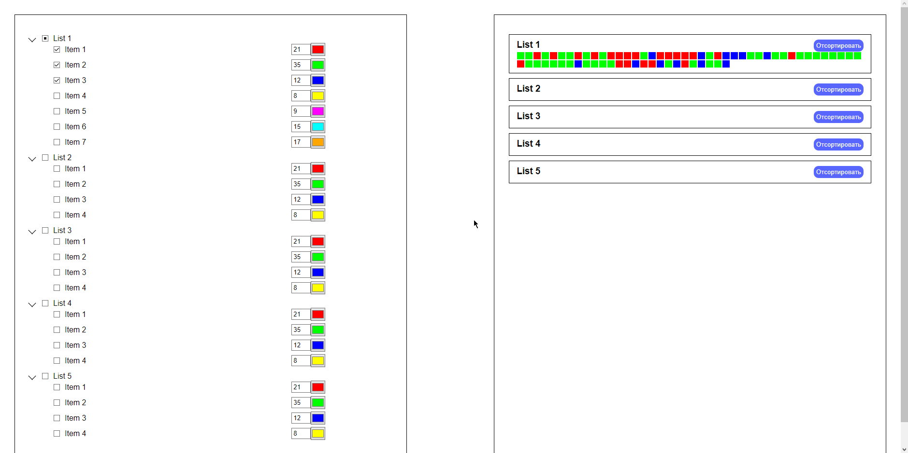

# Tests-HH
Посмотреть функционал можно по [ссылке](https://test-for-hh-1.vercel.app)

## Описание проекта

Этот проект написан на Vue 3 и представляет собой интерактивный сайт с множеством списков и элементов. Вот основные функции сайта:

### Списки и элементы

- Слева находится множество списков.
- Каждый список содержит множество элементов (Item).
- У каждого элемента есть:
    - Количество (input),
    - Чек-бокс для активации,
    - Выбор цвета.

### Управление списками

- Каждый список можно сворачивать.
- У каждого списка есть свой чек-бокс для активации и деактивации всех элементов внутри.

### Цветные квадратики справа

- Справа для каждого списка есть блок с множеством цветных квадратиков.
- Каждый квадратик имеет цвет, аналогичный цвету элемента из списка.
- Количество квадратиков соответствует выбранному количеству из элемента.

### Сортировка и перемешивание

- Квадратики можно отсортировать.
- Можно снова перемешать порядок квадратиков.

### Динамические изменения

- Если изменить цвет или количество элемента в реальном времени, то количество и цвет квадратиков справа также изменится в реальном времени.

## Установка и запуск проекта

1. Склонируйте репозиторий на свой локальный компьютер.
2. Установите зависимости с помощью команды `npm install`.
3. Запустите проект с помощью команды `npm run serve`.
4. Откройте приложение в браузере по адресу `http://localhost:8080`.

## Дополнительная информация

Для более подробной информации о проекте и его компонентах обращайтесь к документации и комментариям в исходном коде.

## Связь:
- Telegram: https://t.me/LeylinV
- GitHub: https://github.com/LeylinV